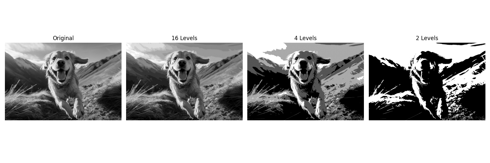
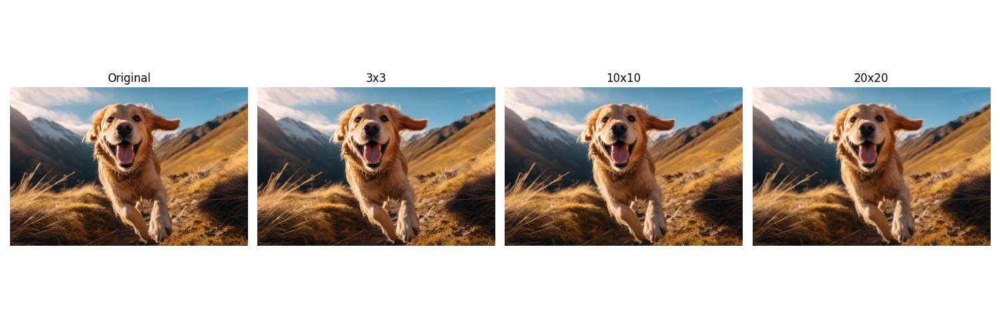
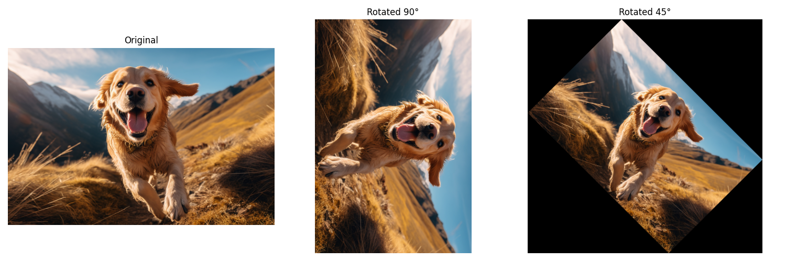
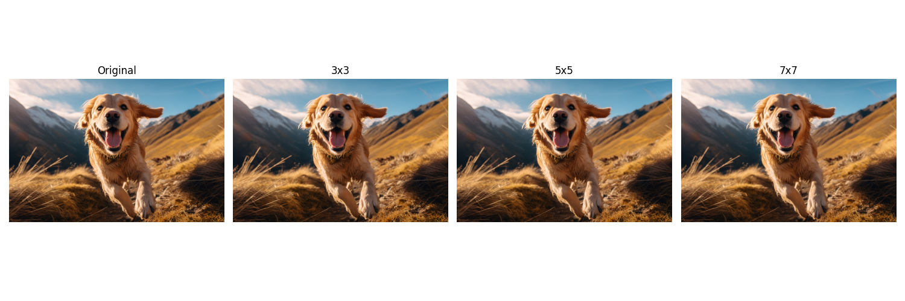

#EC7212 - Computer Vision and Image Processing Assignment
##Image Processing Operations

This project is developed as part of the EC7212 - Computer Vision and Image Processing course. It showcases the implementation of four fundamental image processing operations using Python, leveraging the efficiency of OpenCV and NumPy for computation and visualization.

## Objectives
Python programs to perform the following image processing operations:

1. Intensity Level Reduction
Reduce the number of intensity levels in an image from 256 down to 2, in powers of 2 (e.g., 16, 4, 2). The desired level is passed as a variable input.

2. Spatial Averaging
Load an image and apply average filtering using 3×3, 10×10, and 20×20 kernels to smooth the image.

3. Image Rotation
Rotate the image by 45° and 90° using both fast and transformation matrix-based methods.

4. Spatial Resolution Reduction
Divide the image into non-overlapping blocks (3×3, 5×5, 7×7) and replace each block with its average pixel value, simulating reduced spatial resolution.

## Project Structure
```xml
ImageProcessingProject/
├── tasks/
│ ├── init.py # Makes 'tasks' a Python package
│ ├── utils.py # Helper functions (image loading, display)
│ ├── task1_intensity.py # Logic for intensity level reduction
│ ├── task2_averaging.py # Logic for spatial averaging (uses OpenCV)
│ ├── task3_rotation.py # Logic for image rotation (uses OpenCV)
│ └── task4_resolution.py # Logic for spatial resolution reduction
├── main.py # The main script to run all tasks
├── input_image.jpg # A sample source image
├── requirements.txt # Project dependencies
└── results_opencv/ # Directory where output images are saved
```

## Getting Started
✅ 1. Prerequisites
Python 3.7+
Git
✅ 2. Setup Instructions
Clone the repository:
```xml 

git clone https://github.com/HashiniPrabuddhika/EC7212-Computer-Vision-and-Image-Processing-Assignment.git
cd EC7212-Computer-Vision-and-Image-Processing-Assignment
```
## Create and activate a virtual environment:
```xml
# For Windows
python -m venv venv
venv\Scripts\activate

# For macOS/Linux
python3 -m venv venv
source venv/bin/activate
Install the dependencies:

pip install -r requirements.txt

```

✅ 3. Running the Project
Execute the script to run all four image processing tasks:
```xml
python main.py
```
Process the input_image.png and save all visual results in the results_opencv/ folder.

## Results and Explanations
Task 1: Intensity Level Reduction
Concept: This operation reduces the number of gray levels in an image, known as intensity quantization. Instead of 256 levels (8-bit), the image is mapped to smaller intensity levels (e.g., 16, 4, 2). This technique is commonly used in compression and simplification tasks.

Implementation: Using NumPy, the image pixel values are divided into equal intervals and mapped to representative intensity values.

Result: 


Intensity Level Reduction As the number of levels decreases, smooth gradients in the image are replaced by abrupt transitions. This introduces visual artifacts such as false contouring or posterization, especially at lower levels.

Task 2: Spatial Averaging
Concept: Spatial averaging is a low-pass filtering method used to reduce noise and smooth images. It replaces each pixel with the average value of its surrounding neighborhood.

Implementation: Using OpenCV's cv2.blur() function, the image is filtered with kernels of size 3×3, 10×10, and 20×20.

Result: 

With a 3×3 kernel, slight blurring is observed, preserving most image details.

The 10×10 and 20×20 kernels produce progressively smoother images, effectively suppressing high-frequency content (edges and textures) but also reducing detail clarity.

Image Rotation
Concept: Image rotation is a geometric transformation used for alignment, augmentation, and visualization. A key challenge is avoiding clipping when rotating by non-right angles.

Implementation:

- 90° Rotation: Performed using OpenCV's efficient cv2.rotate() function.

- 45° Rotation: Achieved via affine transformation (cv2.warpAffine) with a dynamically computed bounding box to preserve the full rotated image without cropping.

Result: 

- The 90° rotation is clean and exact.

- The 45° rotation is placed in an expanded canvas, avoiding corner clipping and preserving the entire visual content.

Task 4: Spatial Resolution Reduction
Concept: This technique simulates the effect of reducing an image’s resolution by grouping pixels into blocks and replacing each block with its average value, a process often referred to as pixelation.

Implementation: For block sizes 3×3, 5×5, and 7×7, the image is traversed in non-overlapping chunks. The mean color is calculated for each block and applied uniformly.

Result: 

- Smaller blocks (3×3) retain more detail while introducing a mild pixelated effect.

- Larger blocks (7×7) produce a noticeable mosaic-style degradation of spatial detail, which effectively demonstrates downsampling principles.

Output folder
Saved in results_opencv/ automatically after the code runs
```xml
  Operation          | Output Example      
-------------------- | ---------------------- 
Intensity Reduction  - task1_intensity.png  
Spatial Averaging    - task2_averaging.png  
Image Rotation       - task3_rotation.png  
Resolution Reduction - task4_resolution.png
```
